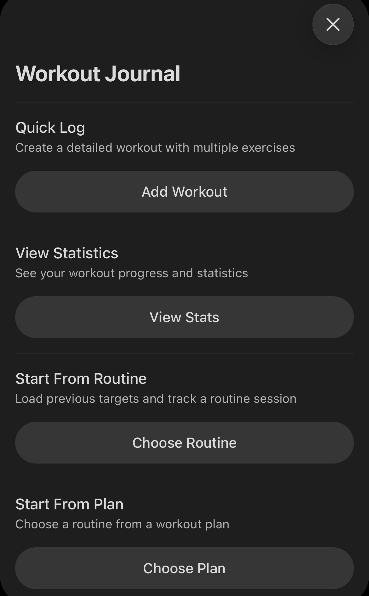
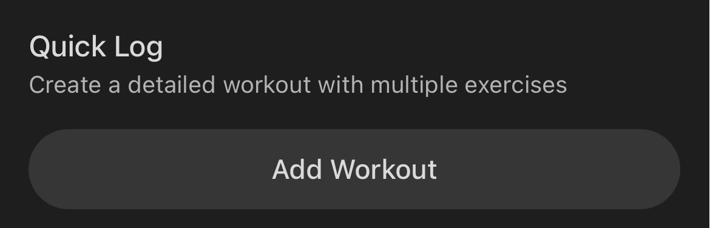
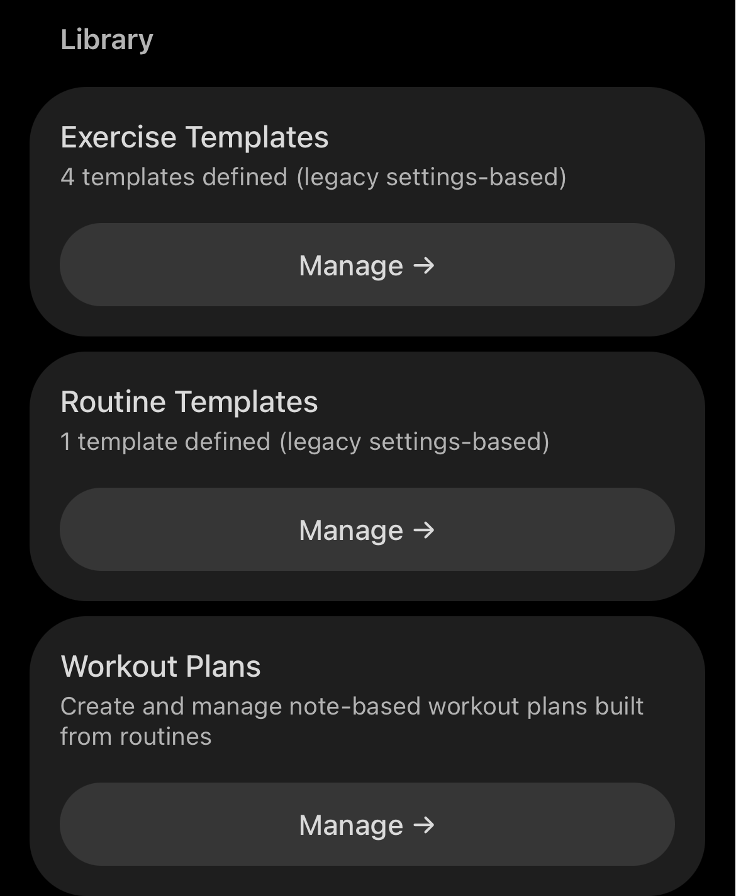
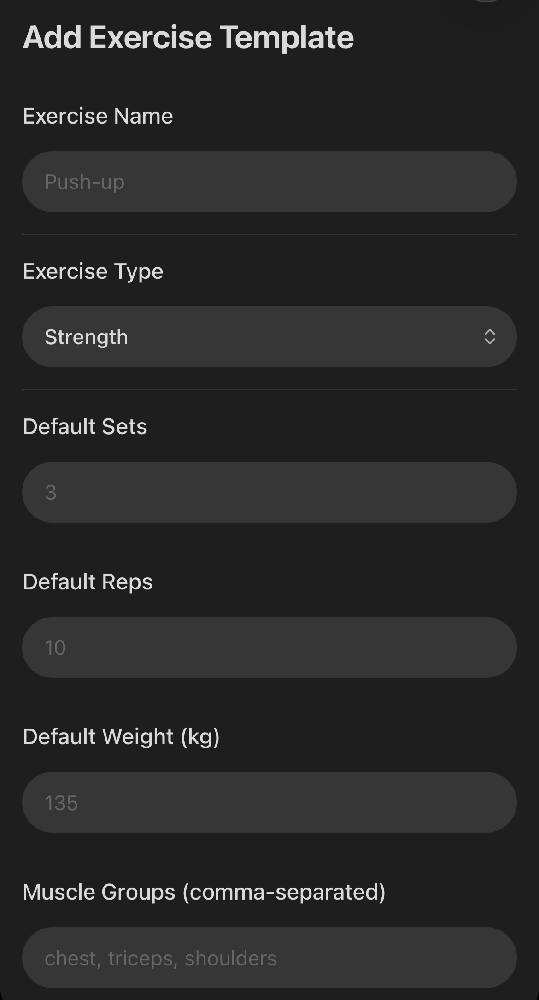
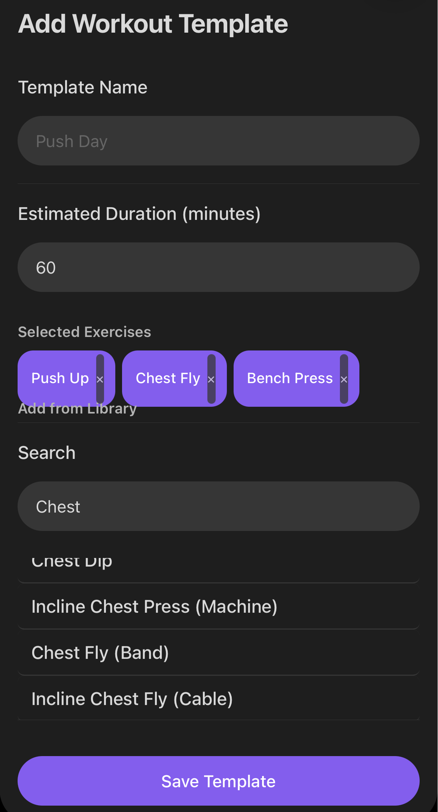
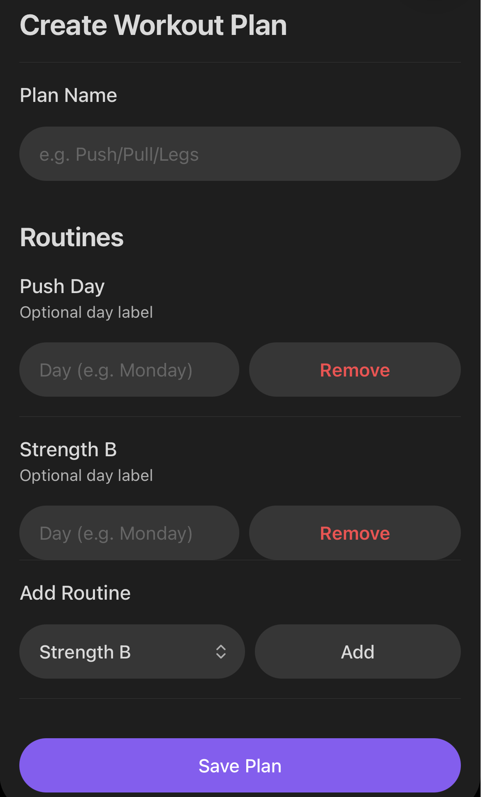
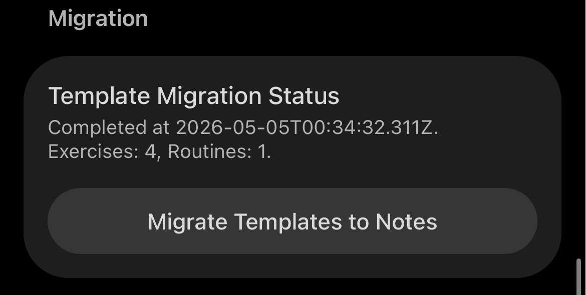

# Obsidian Workout Journal Plugin

This plugin aims to provide a comprehensive workout tracking solution within
Obsidian. The focus is on providing a user experience reminiscent of dedicated
fitness apps, while allowing enough customization and flexibility to fit
various Knowledge Management Systems (KMS) and personal workflows. 

The project originally started as a fork of the very nice [Obsidian Workout
Tracker](https://github.com/wanabeunique/obsidian-workout-tracker) plugin. But
the new feature set has grown to such an extent that I want to share it as a
separate plugin.

So far the plugin is mostly self-tested and was specifically designed to be used in my own vault. But I hope it can be useful to others as well, and I welcome any feedback, bug reports, or contributions.

## Features

- **Exercise Logging**: Track sets, reps, weights, duration, and distances
- **Workout Templates/Routines**: Create reusable routines that you
  repeatedly train and keep notes on your sessions 
- **Workout Plans**: Create structured Workout Plans build from routines
- **Exercise Library**: Build your own exercise library with muscle group
  targeting
- **Simple Note Creation**: Simple and intuitive UI in settings to manage templates, plans, and library
- **Active Workout Sessions**: Start an interactive workout session in a
  dedicated window, quickly log exercise values, add new sets, exercises, and
  notes on the fly (closely mirror the experience of a dedicated fitness app)
- **Date Management**: Automatic date formatting and file organization
- **Customizable**: Configurable folders, add to the templates to improve
  compatibility with your current vault
- **Statistics & Analytics**: View comprehensive workout statistics and progress tracking
- **Frontmatter Storage**: Workout data stored in YAML frontmatter for easy parsing and editing
- **Edit Workouts**: Edit existing workouts with full frontmatter
  synchronization
- **Mobile Support**: Designed to work well on mobile devices for logging
  workouts in the Gym
- **Workout History**: Each completed workout is saved as a separate markdown
  file with structured data and human-readable content. All data is furthermore
  stored in a csv file for easy analysis and migration to other tools if desired.
- **Import from Strong App**: Easily import workout data (workout.csv) from the
  Strong App to quickly migrate your existing workout history into Obsidian,
  with an option to create an exercise note for each unique exercise encountered during import

## Installation

### With BRAT (Recommended for Beta Testing)1. Install the [BRAT plugin](https://github.com/TfTHacker/obsidian42-brat) in Obsidian
2. Open BRAT settings and click **"Add Beta plugin"**
3. Enter this repo URL:
   `https://github.com/I-am-Rudi/obsidian-workout-journal.git`
4. Choose version (e.g., `latest` or a specific release tag)
5. Click **Add Plugin**
6. Enable **Workout Journal** in Settings → Community Plugins

### Manual Installation (Development)

1. Clone or download this repository
2. Copy the plugin folder to your vault's `.obsidian/plugins/` directory
3. Install dependencies: `npm install`
4. Build the plugin: `npm run build`
5. Enable the plugin in Obsidian settings

### From Obsidian Community Plugins (Coming Soon)

I will submit the plugin to the official Obsidian Community Plugins directory. Once approved, you can install it directly from the Obsidian app.

## Usage (with some screenshots from the iOS version)

### Interfaces Overview
- **Ribbon Icon**: Quick access to start a new workout or open the statistics
  view, includes a Quick Log option for creating a workout on the fly without a
  template
  
- **Command Palette**: Access all plugin commands for creating, editing, and
  viewing exercises, workouts, plans, and statistics
- **Settings**: Manage workout templates, exercise library, and plugin
  configuration, including date formatting and default folders as well as import options for Strong App data

### Creating a New Workout

- Create a new workout while you perform it with "Quick Log"

  
-  Use the command palette: "Workout Journal: Create New Workout"
- Use settings to create workout templates for your common routines (e.g.,
  "Full Body Workout", "Leg Day", etc.)
- Create a routine from an already completed workout to reuse it in the future
  with the "Create Routine from Current Workout" command
- You can also directly create a workout file in the right folder with the
  right frontmatter and content structure, and the plugin will recognize it as
  a workout file. **This is in general not recommended, use the `Add .... Note`
  command instead.**

### Active Workout Session
You can start an active workout session for any workout file created by the plugin. This opens a dedicated interface where you can quickly log exercise values, add new sets, exercises, and notes on the fly. The session is designed to closely mirror the experience of a dedicated fitness app, allowing you to focus on your workout while keeping your data organized.

This is possible from the ribbon menu, or by opening an existing routine and
run `Start Workout Session from Current Note` command.

### Manage Exercises, Routines, and Workout Plans
- Use the settings interface to create and manage your exercise library, workout
  templates, and workout plans



- Create an exercise



- Create a routine/workout template

+

- Create a workout plan



- Do not forget to migrate to notes in the general settings after creating




### Viewing Statistics

Use "Workout Journal: View Workout Statistics" to see comprehensive analytics
about your workout progress.

### Import History from Strong App

Strong App allows users to export their workout history as a CSV file. In the
settings of the plugin, you can find an option to import this CSV file. The
plugin will parse the CSV data and **create individual workout files for each
entry, preserving all relevant details such as exercises, sets, reps, weights,
and notes**. Additionally, there is an **option to create exercise notes for each
unique exercise encountered during the import process**, allowing you to build
your exercise library seamlessly from your Strong App data.

>[!tip] 
> Using the `Create Routine from Current Workout` command on a workout imported
> from Strong App is a great way to quickly migrate your existing workout
> routines into reusable templates within Obsidian.

>[!warning]
> The definition of the exercises imported this way is incomplete, so it is recommended to edit the created exercise notes after import to add muscle group targeting and other relevant information. 

### Editing Existing Workouts

1. Open any workout file created by the plugin
2. Use "Workout Journal: Edit Current Workout" command
3. Modify exercises, sets, or notes
4. Save to update the frontmatter automatically

### Exercise Templates

Insert exercise templates directly into your notes using "Workout Journal: Insert Exercise Template" command.

### Workout File Format

The plugin creates structured markdown files with YAML frontmatter for data storage and human-readable content below:

```markdown
---
id: "1672531200000"
date: "2025-06-26"
name: "Morning Run"
duration: 30
exercises:
  - name: "Running"
    sets:
      - duration: 30
        distance: 3
    notes: "Good pace, felt strong"
notes: "Beautiful morning for a run"
workoutTracker: true
---

# Morning Run

**Date:** 2025-06-26
**Duration:** 30 minutes

## Exercises

### Running

| Set | Reps | Weight | Duration | Distance | Rest |
| --- | ---- | ------ | -------- | -------- | ---- |
| 1   | -    | -      | 30       | 3        | -    |

**Notes:** Good pace, felt strong

## Notes

Beautiful morning for a run
```

### Statistics & Analytics

Access comprehensive workout statistics including:

- Total workouts, exercises, and sets
- Total volume (weight lifted)
- Exercise frequency analysis
- Personal records tracking
- Workout streaks
- Recent activity summaries

## Configuration

Access plugin settings through Settings → Community Plugins → Workout Journal:

- **Default Workout Folder**: Where workout files are saved
- **Exercise Templates**: Pre-configured exercises with defaults
- **Workout Templates**: Complete workout routines
- **Date Format**: Customize how dates appear in files

## Development

### Setup

```bash
# Install dependencies
npm install

# Development build with watch mode
npm run dev

# Production build
npm run build
```

### Project Structure

- `main.ts` - Main plugin file with core functionality
- `manifest.json` - Plugin metadata
- `package.json` - Node.js dependencies and scripts
- `tsconfig.json` - TypeScript configuration
- `esbuild.config.mjs` - Build configuration

## Architecture

### Modular Service Design

The plugin uses a clean separation of concerns with two main services:

#### **WorkoutFileService**

- Handles all file operations (save, load, update workout files)
- Manages frontmatter parsing and generation
- Ensures data integrity with graceful error handling
- Supports multiple workouts per day with unique timestamps

#### **WorkoutStatisticsService**

- Calculates comprehensive workout statistics
- Tracks exercise frequency and personal records
- Computes workout streaks and progress metrics
- Provides time period analysis and progression tracking

This separation makes the codebase more maintainable, testable, and allows for easy extension of either file handling or statistical features.

## Features in Detail

### Exercise Types Supported

- **Strength Training**: Sets, reps, weight tracking
- **Cardio**: Duration and distance tracking
- **Flexibility**: Duration and notes
- **Custom**: Flexible format for any exercise type

### Data Organization

- Workouts saved in configurable folder structure
- Automatic file naming with date and workout name
- Structured markdown format for easy reading and editing
- Compatible with other Obsidian plugins (dataview, calendar, etc.)

## Contributing

## License

MIT License - see LICENSE file for details

## Support

If you find this plugin helpful, consider:

- ⭐ Starring the repository
- 🐛 Reporting bugs via GitHub issues
- 💡 Suggesting features

## Changelog

### 1.0.0

- Initial release
- Basic workout and exercise tracking
- Template system
- Settings configuration
- Ribbon and command palette integration
